# TypeRacer Lite - Share Edition

A fully client-side typing speed test web app that measures your typing performance and generates shareable result images. Built with vanilla JavaScript, optimized for GitHub Pages deployment.

## Features

- **Real-time typing metrics**: Track keystrokes, correct characters, errors, WPM, and accuracy
- **Visual feedback**: Color-coded character highlighting (green for correct, red for wrong)
- **Shareable results**: Generate and download beautiful result cards (1200x630 PNG)
- **Dark theme**: F1 telemetry-inspired UI design
- **Fully client-side**: No backend required, works entirely in the browser
- **Responsive design**: Works on desktop and mobile devices

## Live Demo

Visit the live site at: `https://franekjemiolo.github.io/typing-test/`

## Project Structure

```
typing-test/
├── index.html          # Main HTML file
├── style.css           # Dark theme styling
├── app.js              # Main application entry point
├── words.txt           # Word list for typing test
├── core/               # Game logic (no DOM)
│   ├── engine.js       # Game state management
│   ├── stats.js        # Statistics calculations
│   └── words.js        # Word provider
├── ui/                 # UI rendering and interactions
│   ├── renderer.js     # Word display renderer
│   ├── results.js      # Results panel
│   └── theme.js        # Theme management
├── export/             # Image generation
│   ├── image.js        # Canvas image generator
│   └── card.js         # Download/share handlers
└── assets/             # Optional fonts or icons
```

## Metrics Explained

- **Keys Pressed**: Total keystrokes in the input field
- **Correct Characters**: Characters matching expected word positions
- **Errors**: Wrong characters typed at any position
- **WPM (Words Per Minute)**: Standard formula: `(correct_chars / 5) / minutes`
- **Accuracy**: `correct_chars / total_keys_pressed * 100`

## How to Use

1. Open the page in your browser
2. Start typing the displayed word
3. Watch your stats update in real-time
4. Complete all words to see your results
5. Download your result image to share

## Local Development

Simply open `index.html` in a web browser. No build step or dependencies required.

```bash
# Using a local server (recommended)
python -m http.server 8000
# or
npx serve
```

Then visit `http://localhost:8000`

## Deployment

### GitHub Pages

1. Push this repository to GitHub
2. Go to **Settings** → **Pages**
3. Set **Source** to `main` branch, `/ (root)` directory
4. Your site will be available at `https://yourusername.github.io/typing-test/`

### Other Static Hosting

This app works on any static hosting service:
- Netlify
- Vercel
- Cloudflare Pages
- AWS S3 + CloudFront

## Customization

### Adding More Words

Edit `words.txt` to add or modify the word list. Words should be separated by whitespace or newlines.

### Changing the Theme

Modify the CSS variables in `style.css`:

```css
:root {
  --bg-color: #0d0f14;
  --text-color: #eeeeee;
  --accent-color: #00ff88;
  --error-color: #ff4444;
  --panel-color: #1a1d24;
  --border-color: #333333;
}
```

### Adjusting Image Export

Modify `export/image.js` to customize the result card design.

## Architecture

The app follows a clean separation of concerns:

- **core/**: Pure game logic, no DOM manipulation
- **ui/**: Rendering and user interactions
- **export/**: Canvas image generation

This architecture makes the codebase maintainable and easy to extend.

### Architecture Diagram

```mermaid
graph TD
    A[Browser] --> B[TypeRacer Lite App]
    
    B --> C[Core Engine]
    B --> D[UI Layer]
    B --> E[Export System]
    
    C --> F[Game State Manager]
    C --> G[Statistics Calculator]
    C --> H[Word Provider]
    
    D --> I[Renderer]
    D --> J[Results Panel]
    D --> K[Theme Manager]
    
    E --> L[Image Generator]
    E --> M[Card Handler]
    
    F --> N[Game State]
    F --> O[Input Handler]
    F --> P[Timer System]
    
    G --> Q[WPM Calculator]
    G --> R[Accuracy Calculator]
    G --> S[Error Tracker]
    
    H --> T[Word List]
    H --> U[Random Selector]
    
    I --> V[Word Display]
    I --> W[Character Highlighting]
    I --> X[Visual Feedback]
    
    J --> Y[Results Display]
    J --> Z[Metrics Panel]
    
    K --> AA[Dark Theme]
    K --> BB[F1 Telemetry Style]
    
    L --> CC[Canvas Renderer]
    L --> DD[Image Generation]
    M --> EE[Download Handler]
    M --> FF[Share System]
    
    subgraph "Core Logic"
        N --> GG[Active Game]
        N --> HH[Completed State]
        O --> II[Keystroke Capture]
        O --> JJ[Input Validation]
        P --> KK[Time Tracking]
        P --> LL[Duration Calculation]
    end
    
    subgraph "Statistics"
        Q --> MM[Words Per Minute]
        Q --> NN[Character Count]
        R --> OO[Accuracy Percentage]
        R --> PP[Correct Characters]
        S --> QQ[Error Detection]
        S --> RR[Mistake Tracking]
    end
    
    subgraph "Word System"
        T --> UU[Word Display]
        T --> VV[Character Position]
        W --> WW[Green Highlight]
        W --> XX[Red Highlight]
        W --> YY[Current Position]
    end
    
    subgraph "Export Pipeline"
        DD --> ZZ[1200x630 PNG]
        DD --> AAA[Result Card Design]
        EE --> BBB[Image Download]
        FF --> CCC[Shareable Link]
    end
    
    subgraph "UI Components"
        DDD[Input Field] --> O
        EEE[Start Button] --> N
        FFF[Reset Button] --> N
        GGG[Results Panel] --> Y
        HHH[Share Button] --> EE
    end
    
    subgraph "Data Flow"
        O --> Q
        Q --> R
        R --> Z
        Z --> DD
        DD --> EE
    end
    
    subgraph "Styling System"
        AA --> III[CSS Variables]
        BB --> JJJ[Dark Theme]
        BB --> KKK[Telemetry Design]
        III --> LLL[Background Color]
        III --> MMM[Text Color]
        III --> NNN[Accent Color]
        III --> OOO[Error Color]
    end
```



## Browser Support

- Chrome/Edge (latest)
- Firefox (latest)
- Safari (latest)
- Mobile browsers (iOS Safari, Chrome Mobile)

## License

MIT License - Feel free to use and modify as needed.

## Future Enhancements

Potential upgrades:
- Timed mode (30s / 60s / infinite)
- Real-time WPM graph
- Ghost typing replay
- Sound feedback
- Leaderboard integration
- Adaptive difficulty

---

Built with vanilla JavaScript, no frameworks required.
